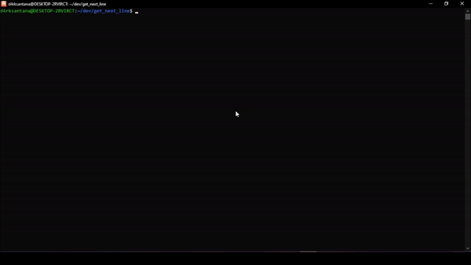

# Get_next_line

Get_next_line é um projeto da grade curricular da 42 Ecole que baseia se em criar uma função que le linha apos linha um arquivo de texto

O proposito desse projeto é compreender o funcionamento das variaveis staticas e como ler arquivos em C e aprender conceitos como EOF entre outros.


## Status

Finalizado e Aprovado


## Demonstraação


## Como obter e compilar?
```
git clone https://github.com/D4rkSantana/get_next_line.git
```
```
cd get_next_line
```
```
gcc  **seu_programa.c** get_next_line.c get_next_line_utils.c get_next_line.h
```

## Aprendizados

Linguagem C, Uso de Arquivos em C, Variaveis Staticas, gerenciamento de memoria, manipulação ponteiros char.


## Referência

 - [42 São Paulo](https://www.42sp.org.br/)
 - [stdlib.h — Linux manual page](https://man7.org/linux/man-pages/man0/stdlib.h.0p.html)
 - [unistd.h — Linux manual page](https://man7.org/linux/man-pages/man0/unistd.h.0p.html)


## Uso/Exemplos

utilizar a função **get_next_line(int fd, char \*\*line)**, a qual recebe o File Descriptor no primeiro parametro e o ponteiro onde sera alocado espaço e passado a linha pela função.

## Autores

- [Emerson Silva S](https://github.com/D4rkSantana)


## Etiquetas

[](https://choosealicense.com/licenses/mit/)
